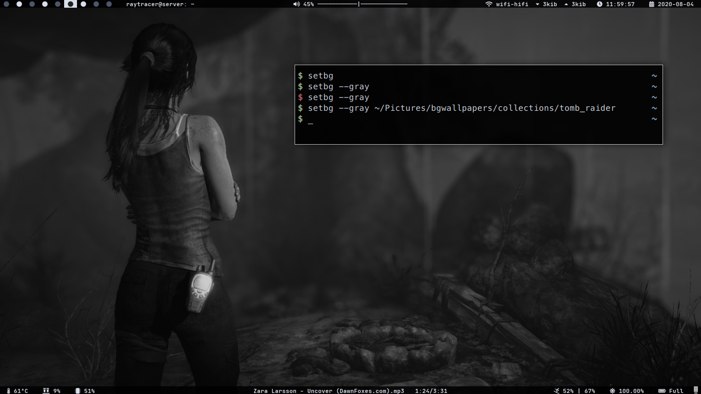

# Improved Wallpaper Changer

These are couple of scripts to make Wallpaper changing fun and exciting.

## setbg

This script is the wallpaper changer script. Let's see what it can do,


Check this out:


### Features:

Following are few highlights(taken from the help menu of script):

```
Usage:  setbg [--gray] [Options]

        [no arg]:               If no arg then sets random wallpaper from specified directory in script
        [filename]:             If first arg is image then set it as Wallpaper
        [directory]:            If first arg is directory then choose an image randomly
                                and set as wallpaper
        --gray:                 If provided arg with no file or directory name then
                                chooses a random wallpaper from specified directory in script
        --gray [path]:          Same as above options but changes image to grayscale
        --autochange, -a:       Put script with this parameter on startup utility
                                and it'll change your wallpaper everytime on startup
        --daemonize yes:        Makes the script set random wallpaper
        --kill:                 Script kills itself if running as daemon
        --restart:              Script kills and restarts itself again as daemon
        --help:                 Show help


Change <pic_dir> variable in script to the desired path of wallpaper's directory
Change <time_to_sleep> variable provided on top of script according to you
Wallpaper changed to grayscale are perfectly balanced in RGB color property
```

Note: You can also bind this script with appropirate flags to shortcuts and Enjoy!

## wp

This script opens the wallpaper randomly shuffled inside [sxiv](https://github.com/muennich/sxiv)

You can bind a shortcut inside sxiv to set the wallpaper from there and seeing the Wallpaper

How to do it, You ask?

Check it out [here](https://github.com/coolabhays/my-config-files/blob/master/.config/sxiv/exec/key-handler)
